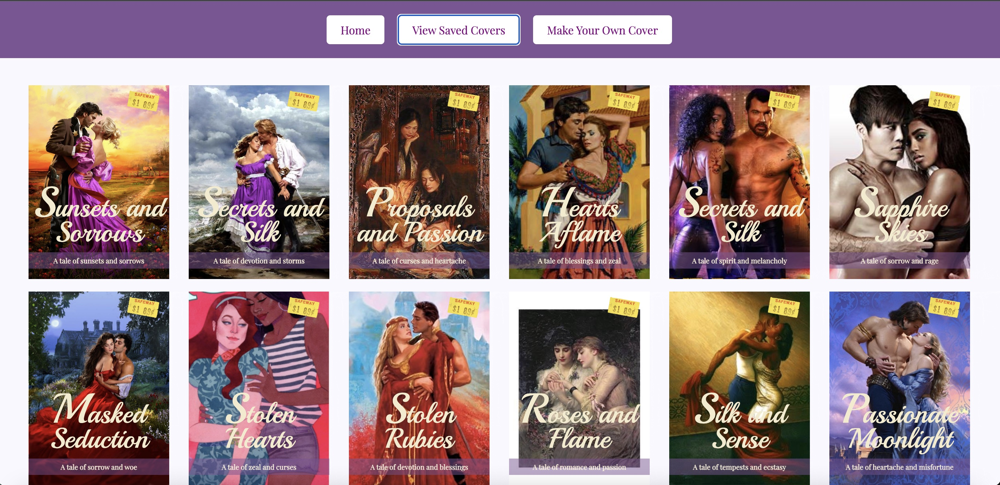

# RomCom  

### Abstract:
[//]: <> (Briefly describe what you built and its features. What problem is the app solving? How does this application solve that problem?)

Romcom is an application that generates random formulaic covers for romance novels. It allows the guest to click and initiate a unique image and word combination, to save those instances on a separate view, and to delete them later. It also gives the visitor the option to create their own cover with text and image input fields and displays a properly formatted cover based on the values input by the user.

### Installation Instructions:
[//]: <> (What steps does a person have to take to get your app cloned down and running?)

To run Romcom, you can fork this repo, clone it to your local computer, and open it by using the open index.html command in your terminal.

### Preview of App:
[//]: <> (Provide ONE gif or screenshot of your application - choose the "coolest" piece of functionality to show off.)

Here is a screenshot of one of the sections of our application. This page is accessed by clicking the 'View Saved Covers' button anddisplays all covers that a user has saved. Double clicking any of these covers on this page will delete the cover from the page.

### Context:
[//]: <> (Give some context for the project here. How long did you have to work on it? How far into the Turing program are you?)

We began this project in week 2 of mod 1 of the Turing program. We spent around 20 hours collaborating remotely between December 6th 2022 and December 11th 2022 to complete this project.

### Contributors:
[//]: <> (Who worked on this application? Link to their GitHubs.)

- Katherine Blaine - [github profile](https://github.com/KatherineBlaine)
- Chrissy Cooper - [github profile](https://github.com/chrissycooper)

### Learning Goals:
[//]: <> (What were the learning goals of this project? What tech did you work with?)

The learning goals of this project were to:
 
 - Use clean, dry, JavaScript to use a provided class by creating object instances and manipulate the page after it has loaded addingm removing, and updating elements on the DOM.
 - Explore the connection between HTML, CSS, and JavaScript by practicing reading, understanding, and using provided code.
 - Write code collaboratively by documenting changes with 'atomic' commits and thorough code reviews and communicating, troubleshooting, and planning effectively as a team.

### Wins + Challenges:
[//]: <> (What are 2-3 wins you have from this project? What were some challenges you faced - and how did you get over them?)

Project Wins:
- We spent a very long time on the early iterations of this project. While it was slightly stressful to move through the project slowly, our carefully thought out elements created a strong basis of understanding that allowed us to be really successfuly and efficient in the later iterations of the project.
- We researched a new topic called 'event targeting' to allow the user to double click covers they have saved to delete them. We not only got a basic understanding of a concept we will learn later in mod 1, but we were able to create a succinct function to achieve the desired functionality. 
- We enjoyed working through this project and felt really accomplished when it was completed. We collaborated really well and it was awesome to be able to see the functionality of all of the concepts we have been learning throughout the past few weeks in an actual application.

Project Challenges:
- Because it was our first time creating a project using the git workflow collaboratively, we spent a long time at the beginning of our project trying to work through merge conflicts, successfully work on our repo on separate branches, and establish a productive collaborative flow creating, reviewing, and merging pull requests. We struggled through this for quite a while, but learned so much and improved this skill immensely by the end of the project. 